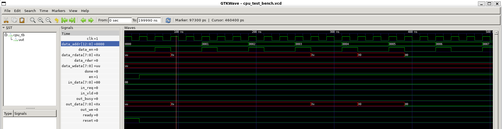

# Procesor ve VHDL pro jazyk Brainfuck


## Popis
Implementace jednoduchého procesoru ve VHDL, který vykonává instrukce rozšířeného jazyka Brainfuck. Procesor obsahuje jednotnou paměť, podporuje I/O operace a běží na definovaném rozhraní. Cílem bylo vytvořit syntetizovatelný návrh včetně podpory většiny instrukcí jazyka a automatických testů.

---

## Použití

Aplikaci můžete spouštět, jak pro vývoj tak pro demonstaci, buď [přes docker](#spuštění-programu-s-dockerem), nebo [instalací nástrojů `ghdl` a `gtkwave`](#spuštění-programu-s-ghdl-a-gtkwave). 


### Závislosti a předpoklady

- Linux (Testováno s WSL - Ubuntu 22.04.5 LTS)
- Docker - volitelně, nutné pouze při práci s Dockerem

### Instalace

Naklonujte repozitář
```bash
git clone git@github.com:petr-plihal/cpu-for-brainfuck.git
cd cpu-for-brainfuck
```

### Spuštění programu s Dockerem

1. Spusťte aplikaci
    ```bash
    [Zde přidejte příkazy]
    ```

### Spuštění programu s `ghdl` a `gtkwave`

1. Nainstalujte závislosti
    ```bash
    sudo apt update
    sudo apt install ghdl gtkwave
    ```

2. Spusťte procesor přes test bench - lze použít skript `run.sh`, případně příkazy z něj provést manuálně.
    ```bash
    ./run.sh
    ```

    Otevře se okno grafického rozhranní GTKWave, kde lze vidět jednotlivé signály a jejich hodnoty, viz:
    
    V tomto případě jde o provedení jednoduchého programu 


### Testovací programy

---

## Licence
Tento projekt je licencován pod GNU General Public License v3.0. Podrobnosti naleznete v souboru [LICENSE](LICENSE).
